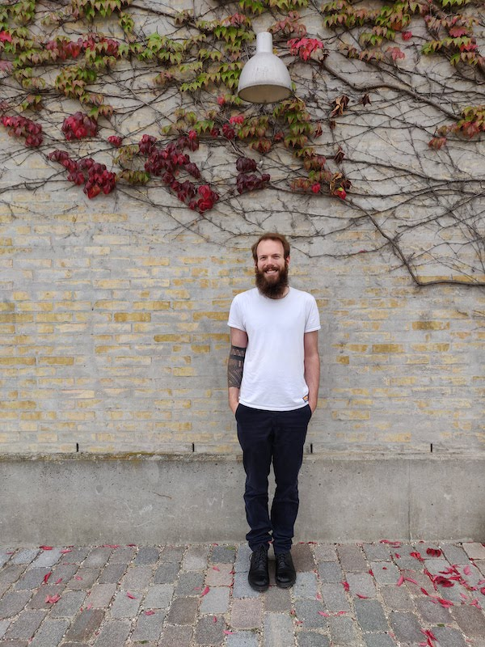

I am Moritz do Rio Schulze, a software developer based in Berlin,
Germany.

I program mostly in Kotlin, Java and Typescript/Javascript. Through
my career I have not only worked as a developer but also with devops
technologies and as a team lead.

Read more about me [here](/about_me)
